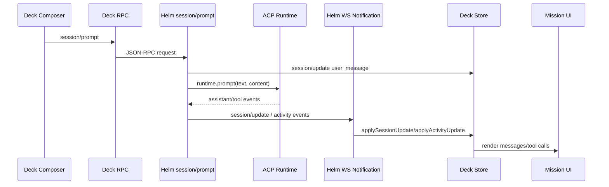

# Deck ↔ Helm 本地联调 Smoke Checklist

> 目标：在代码改动后，用最短路径确认 Deck 能连接本地 Helm、创建/恢复 session、发送 Prompt、接收实时事件，并能完成取消、历史重导入和清理。

## 1. 启动

### Helm

默认本地 Helm 地址：`http://127.0.0.1:47631`

```powershell
pnpm --filter @tiller/helm dev
```

期望：

- 终端没有启动报错。
- HTTP 监听在 `127.0.0.1:47631`。
- 如果端口被占用，先关闭旧 Helm，再重启。

### Deck

```powershell
pnpm --filter @tiller/deck dev
```

期望：

- Vite 启动成功。
- 浏览器打开 Deck 页面。

## 2. 连接与基础库存

1. 打开 Deck。
2. 确认 Helm 连接状态为已连接/paired。
3. 检查项目列表、worktree 列表、Agent 列表是否能显示。
4. 打开 Mission 工作台。

期望：

- Project / Worktree / Agent 数据能正常刷新。
- 如果 Agent 列表为空，先检查 Helm 端 Agent registry 配置。

## 3. Draft 与模型/命令库存

1. 选择一个 project/worktree。
2. 选择一个 ACP Agent。
3. 等待 draft runtime ready。
4. 检查模型、reasoning、可用 slash command 是否显示。

期望：

- Draft 卡片显示准备创建会话。
- 模型 picker 不应丢失当前已选模型。
- slash command 列表应和 Helm/ACP 上报一致。

常见问题：

- 一直显示连接中：检查 Helm 日志里的 ACP provider 启动错误。
- 模型为空：检查 `session/draft` 结果里的 `modelOptions` / `configOptions`。

## 4. 发送 Prompt 实时链路

发送一个短 Prompt，例如：

```text
你好，回复一句确认消息。
```

期望链路：



期望现象：

- 用户消息立即出现在 timeline。
- assistant 消息或 tool activity 实时追加。
- Prompt 完成后 session 状态回到 idle 或对应最终状态。

排查点：

- Deck 没发出请求：检查 composer `canSend`、Helm pairing 状态。
- Helm 收到但 ACP 不响应：检查 Helm 终端 `阶段=发送Prompt` 后是否有 provider 错误。
- ACP 有输出但 UI 不更新：检查 `session/update` WebSocket 与 Deck `server-events`。

## 5. 图片输入能力

如果 Agent 支持图片：

1. 粘贴或选择一张小图。
2. 发送 Prompt。

期望：

- Helm 端 log 包含 `images=1`。
- 用户消息保留附件。

如果 Agent 不支持图片：

- 应提示 `当前 ACP Agent 未声明图片输入能力，无法发送图片喵~`。
- 不应调用 ACP runtime prompt。

## 6. 取消 / 恢复 / 重导入 / 清理

### 取消

1. 发送一个较长任务。
2. 点击取消。

期望：

- Helm 调用 runtime cancel。
- session 不再继续追加输出。

### 恢复

1. 重启 Helm 或刷新 Deck。
2. 打开历史 session。

期望：

- 如果 runtime 仍可恢复，显示恢复中并刷新 ACP connection inventory。
- 如果不可恢复，允许 history-only 浏览。

### 重导入历史

1. 对一个 session 执行“重新导入历史”。

期望：

- messages / outputs / toolCalls / diffs 被 provider 历史替换。
- 成功 toast：`历史已从 ACP 重新导入。` 或 provider 返回消息。
- 失败消息包含“失败”时显示 warning toast。

### 清理

1. 执行清理会话。

期望：

- 本地 session 从列表移除。
- 相关 messages / outputs / toolCalls / diffs / config options 被清除。
- remote delete 成功显示“会话已删除”。

## 7. 联调前必跑命令

```powershell
pnpm --filter @tiller/helm typecheck
pnpm --filter @tiller/deck typecheck
pnpm --filter @tiller/deck lint
pnpm typecheck
```

可选 targeted tests：

```powershell
pnpm --filter @tiller/helm exec tsx --test src/runtime/session-runtime-router.test.ts
pnpm --filter @tiller/deck exec tsx --test src/features/server-events/server-events.test.ts
```

## 8. 记录问题时请带上

- Deck 页面当前操作步骤。
- Helm 终端从 `阶段=发送Prompt` 开始的日志片段。
- 是否出现 `debug/prompt_trace`。
- sessionId、agentId、cwd。
- 预期现象和实际现象。
